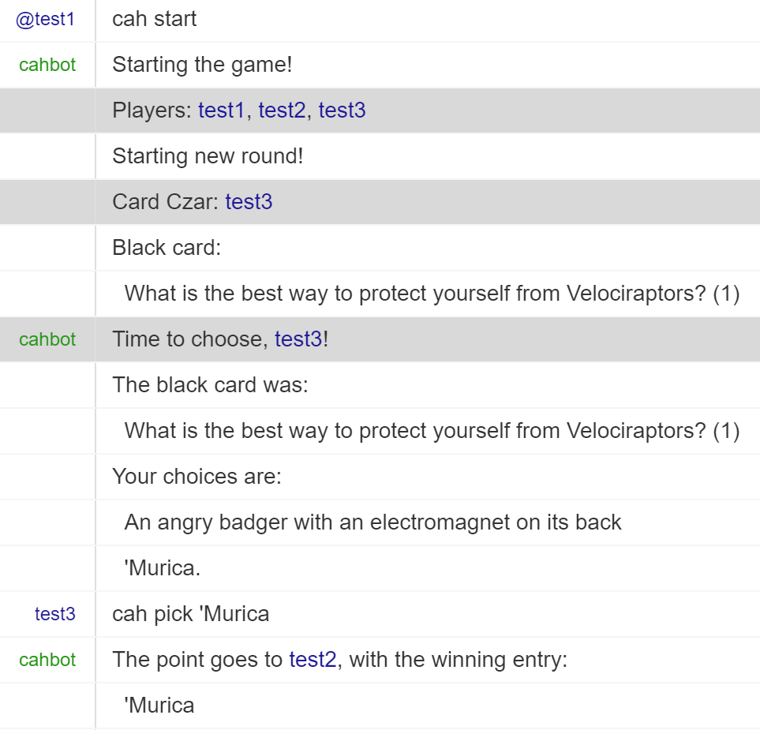

Cards Against Humanity
======================

An extensible Cards Against Humanity game engine. Just

1. `make install` and
2. `python -m cah -h`

to get started.

The program will hook up to an IRC channel you specify, from which you should be able to type `cah help` to get information on how to play the game.

